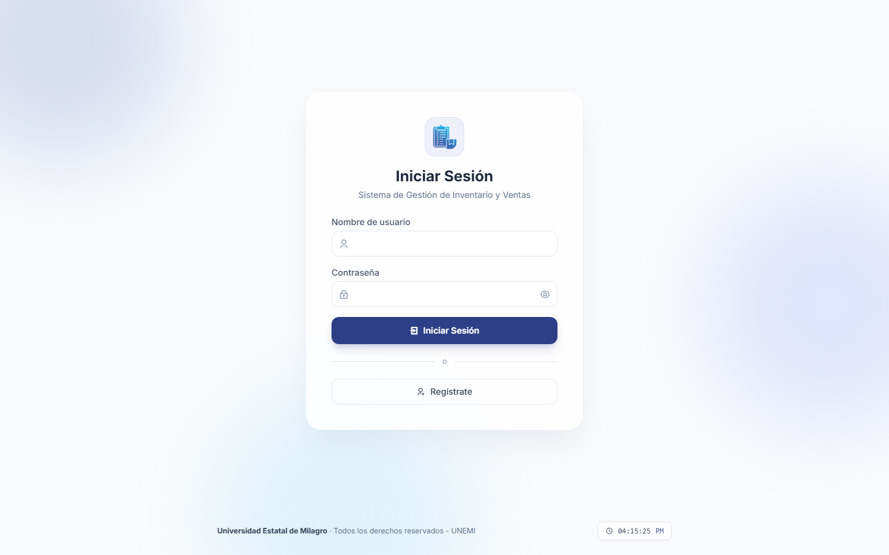

# SGIV — Sistema de Gestión de Inventario y Ventas

Aplicación web desarrollada en **Flask** para la administración de inventario, ventas y usuarios de un negocio, con soporte para carrito de compras, importación/exportación de datos en Excel y visualización de estadísticas mediante gráficos. Interfaz moderna construida con **TailwindCSS**.



## Características

- **Dashboard**: panel de bienvenida con accesos directos a cada módulo del sistema.
- **Autenticación de usuarios**: registro e inicio de sesión con contraseñas cifradas (SHA-256) y sesiones persistentes en el servidor.
- **Gestión de inventario**: registro, edición, eliminación y búsqueda de productos por nombre o categoría, con imagen asociada.
- **Importación/Exportación en Excel**: carga masiva de productos desde una plantilla `.xlsx` y descarga del inventario actual.
- **Carrito de compras**: agregar, ajustar cantidad y eliminar productos, con cálculo automático del total.
- **Registro de compras**: confirmación de compra que descuenta stock y limpia el carrito.
- **Panel de estadísticas**: gráficos de pastel y de barras (Chart.js) sobre productos vendidos y gasto por usuario.
- **Perfil de usuario**: edición de datos personales y foto de perfil almacenada como BLOB en la base de datos.
- **Administración de usuarios**: listado y búsqueda en tiempo real de usuarios registrados.

## Tecnologías utilizadas

| Capa | Tecnología |
|---|---|
| Backend | Python 3, Flask |
| Base de datos | SQLite3 |
| Procesamiento de datos | Pandas, OpenPyXL |
| Frontend | HTML5, TailwindCSS (CDN), Chart.js, SweetAlert2, Remix Icon |
| Sesiones | Flask Session (filesystem) |

## Estructura del proyecto

```
SISTEMA_GESTION_INVENTARIO_VENTAS_FLASK/
├── app.py                     # Rutas y lógica principal de Flask
├── Bases_datos/
│   └── conexion_sqlite.py     # Acceso y operaciones sobre la base de datos SQLite
├── Base1                      # Archivo de base de datos SQLite (no versionado)
├── templates/                 # Vistas HTML (Jinja2 + Tailwind), base.html/base_auth.html como layouts
├── static/                    # CSS/JS propios e imágenes (logo, favicon)
├── flask_session/             # Almacenamiento de sesiones en filesystem (no versionado)
├── .gitignore
└── requirements.txt           # Dependencias del proyecto
```

## Instalación

1. **Clonar el repositorio**

   ```bash
   git clone <url-del-repositorio>
   cd SISTEMA_GESTION_INVENTARIO_VENTAS_FLASK
   ```

2. **Crear y activar un entorno virtual**

   ```bash
   python -m venv .venv
   # Windows
   .venv\Scripts\activate
   # Linux / macOS
   source .venv/bin/activate
   ```

3. **Instalar dependencias**

   ```bash
   pip install -r requirements.txt
   ```

4. **Ejecutar la aplicación**

   ```bash
   python app.py
   ```

5. Abrir el navegador en [http://127.0.0.1:5000](http://127.0.0.1:5000)

## Uso

1. Regístrate desde la pantalla de inicio o inicia sesión con un usuario existente.
2. Desde el menú principal accede a **Gestión de Inventario** para registrar, editar o importar productos.
3. Añade productos al **Carrito de Compras** y confirma la compra.
4. Consulta **Gráficos** y **Productos Vendidos** para ver el detalle de las ventas.
5. Administra tu información desde **Perfil de Usuario**.

## Autor

Proyecto académico — Universidad Estatal de Milagro (UNEMI).
